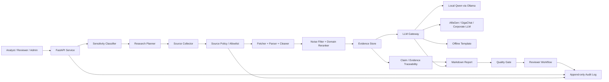

# Bank-Ready Architecture

## Цель

Архитектура показывает, что проект является не внешним чат-ботом, а контролируемым research-конвейером для банковской аналитики по открытым источникам.

Ключевой принцип: внутренняя банковская информация не уходит наружу, а LLM используется только через заменяемый gateway и только на основе сохраненного evidence.

## Data Flow



## Components

### FastAPI Service

Показывает проект как легко интегрируемый сервис, а не notebook-only прототип.

Основные endpoints:

- `POST /research/run`;
- `GET /research/runs/{run_id}/status`;
- `GET /research/runs/{run_id}/report`;
- `GET /research/runs/{run_id}/evidence`;
- `GET /research/runs/{run_id}/claims`;
- `POST /research/runs/{run_id}/review`;
- `GET /admin/source-policy`;
- `PUT /admin/source-policy`.

### Sensitivity Classifier

Rule-based слой, который блокирует запросы с персональными данными или признаками внутреннего банковского контура.

Для MVP это осознанно простая реализация: ее легко объяснить, протестировать и заменить на корпоративный policy engine.

### Source Policy / Allowlist

Policy config:

```text
config/source_policy.json
```

Он задает:

- разрешенные типы источников;
- разрешенные seed source ids;
- заблокированные source ids;
- разрешенные public domains;
- policy notes для audit и metadata.

Admin может менять policy через API, а каждое изменение попадает в audit log.

### Evidence Store

Evidence хранится отдельно от отчета:

```text
reports/api_runs/{run_id}/evidence.jsonl
reports/api_runs/{run_id}/evidence.csv
```

Это позволяет проверить, откуда взялся каждый важный тезис.

### Claim / Evidence Traceability

Каждый отчет получает claim table:

```text
reports/api_runs/{run_id}/claims.jsonl
reports/api_runs/{run_id}/claims.csv
```

Формат связывает `claim_id` с `evidence_ids` и `source_ids`.

### LLM Gateway

Gateway изолирует продуктовую логику от конкретной модели.

Поддерживаемые профили:

- `offline_template`;
- `local_qwen`;
- `alfagen`;
- `gigachat`;
- любой OpenAI-compatible endpoint.

По умолчанию внешние LLM-вызовы выключены. Это важно для банковского демо: безопасный режим воспроизводим даже без интернета и без ключей.

### Quality Gate

Quality gate проверяет:

- достаточно ли clean documents;
- достаточно ли evidence items;
- достаточно ли разных источников;
- есть ли report artifacts;
- не прошел ли sensitive-запрос дальше pipeline.

### Reviewer Workflow

Отчет не считается финальным сразу после генерации:

```text
draft -> reviewed -> approved
draft -> reviewed -> rejected
```

Это показывает human-in-the-loop контур, который ожидаем в банковской аналитике.

### Audit Log

Audit log:

```text
reports/audit/research_runs.jsonl
```

В audit попадают:

- research run events;
- review events;
- source policy update events.

## Demo Narrative

На защите архитектуру стоит объяснять так:

1. Аналитик вводит публичную research-тему.
2. Policy layer проверяет, что запрос не содержит чувствительных данных.
3. Pipeline берет источники только из разрешенного source boundary.
4. Parser и filter превращают документы в evidence.
5. LLM не получает свободу выдумывать: синтез идет поверх evidence.
6. Каждый тезис можно связать с evidence item.
7. Reviewer утверждает отчет.
8. Audit log показывает, кто, что и с какими настройками сделал.

## Why This Is Bank-Ready

Проект закрывает ключевые вопросы банка:

- безопасность данных: default mode не делает внешних LLM-вызовов;
- заменяемость моделей: LLM Gateway поддерживает локальную и корпоративную модель;
- проверяемость: claims связаны с evidence;
- контроль источников: source allowlist вынесен в policy config;
- человеческое утверждение: reviewer workflow встроен в API;
- аудит: все важные действия пишутся в append-only JSONL.
