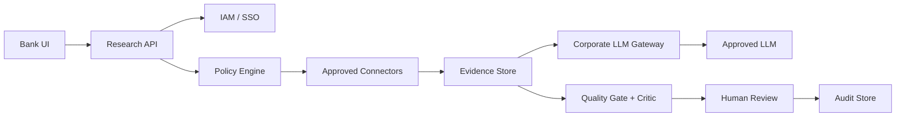

# Roadmap

## Цель

Roadmap отделяет текущий MVP от production-ready банковского решения.

## Сейчас реализовано

### MVP

- Notebook MVP.
- Модульный Python pipeline.
- FastAPI service layer.
- Seed-source collector.
- Parser/cleaner with optional trafilatura/BeautifulSoup HTML cleanup.
- Noise filter, BM25 baseline и source-trust hybrid reranker.
- Evidence store.
- Template report.
- Claim/evidence traceability.
- Deterministic claim critic for unsupported, weak, and numeric-risk claims.
- Quality gate.
- Audit log.
- Reviewer workflow.
- Source allowlist.
- Runtime source policy enforcement.
- Async run polling.
- Run observability metadata with request id and stage timings.
- Upload hardening: file count limit, MIME/content sniffing, SHA-256 metadata, retention metadata.
- Dockerfile, Docker Compose, and Makefile for reproducible open-source startup.
- LLM Gateway.
- Local Qwen profile.
- AlfaGen/GigaChat-ready gateway profiles.
- Lightweight no-build demo UI.
- Generic planner for arbitrary topics.
- Auto source discovery through no-key public connectors.
- User-provided public source URLs through API/UI.

## Ближайшие улучшения

### 1. Demo UI

Сделано как lightweight no-build UI поверх FastAPI:

- input темы;
- таблица runs;
- tabs: report/evidence/claims/review/audit;
- кнопки reviewer workflow;
- audit events.

Файлы:

```text
api/static/index.html
api/static/styles.css
api/static/app.js
```

Почему:

- меньше инфраструктуры;
- легче запускать open-source пользователю;
- API остается главным integration contract.

Следующее улучшение UI:

- export report button;
- source policy editor;
- LLM mode indicator from environment;
- показать уже доступный async progress из `POST /research/run-async` прямо в UI.

### 2. Source connectors

Добавить легитимные источники:

- RSS;
- official APIs;
- вручную одобренные public PDFs;
- search API через обезличенные публичные queries.

Сейчас любая тема, включая CLTV, проходит единый runtime path:

- generic planner;
- query expansion;
- auto source discovery через public connectors;
- runtime source policy filtering перед fetch/parse/ranking;
- optional source URLs и uploads как способ усилить или зафиксировать набор источников;
- evidence extraction, claims, report, quality gate и audit без topic-specific веток.

Если источников мало, система не подставляет evidence от другой темы и не делает вид, что результат полный. Она возвращает частичный, проверяемый отчет с quality signals и рекомендациями по дозагрузке источников.

Не делать ценностью проекта:

- обход anti-bot;
- парсинг закрытых источников;
- отправку внутренних данных наружу.

### 3. Parsing hardening

MVP-level HTML cleanup уже реализован через optional trafilatura/BeautifulSoup fallback.
Production-уровень:

- language detection;
- document deduplication;
- source freshness metadata.
- OCR/table extraction для сложных PDF.

### 4. Better reranking

MVP-level source-trust hybrid ranking уже реализован без обязательных embedding-моделей.
Production-уровень:

- embeddings reranker;
- domain classifier;
- source trust calibration на размеченном наборе;
- block-level coverage scoring.

### 5. Stronger fact checking

MVP-level deterministic critic уже реализован для claim/evidence links, weak support и numeric warnings.
Production-уровень:

- claim extraction from final report;
- contradiction detection;
- LLM/embedding-based semantic entailment;
- reviewer feedback loop для улучшения правил.

### 6. Enterprise security

Production banking layer:

- SSO/IAM;
- secrets management;
- VPC/on-prem deployment;
- structured audit store;
- enforced retention jobs;
- PII detection model;
- policy engine integration.

### 7. Corporate LLM integration

Интеграции:

- AlfaGen adapter;
- GigaChat OAuth/token flow;
- internal OpenAI-compatible gateway;
- model registry;
- prompt/version logging.

## Production Architecture Target



## Что не является целью MVP

- заменять аналитика;
- принимать бизнес-решения автоматически;
- работать с персональными клиентскими данными;
- обходить ограничения сайтов;
- доказывать production-grade безопасность.

MVP показывает архитектурную зрелость и рабочий прототип, который можно развивать в банковском контуре.
